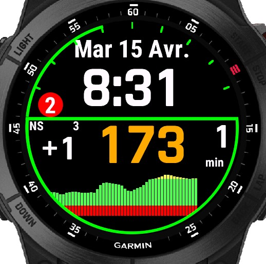
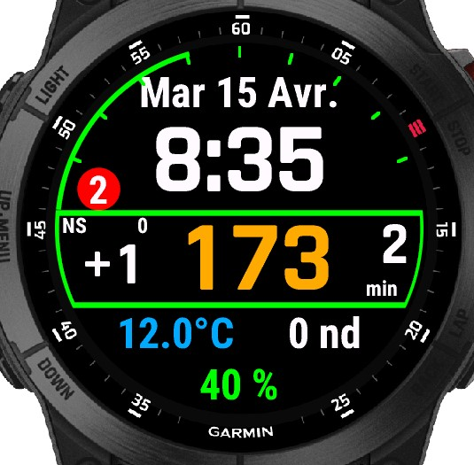
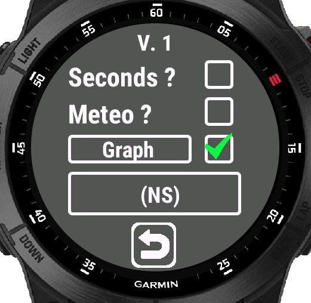
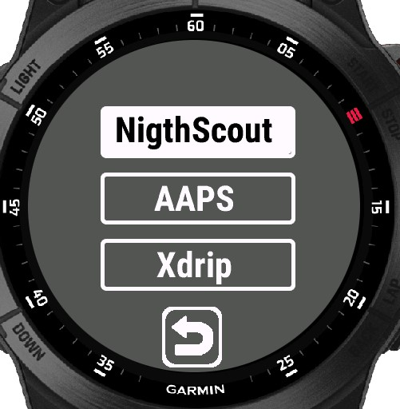

Garmin watchface, with blood glucose. 
In the options, you can chosse to see a glucose graph, or some data in 3 fields (battery, temperature, wind, altitude, steps, heart rate and other). 
For the graph, you can choose 1, 2 4 or 6h
In the settings, you can choose the glucose data source : Nightscout, AAPS or Xdrip
 
  
